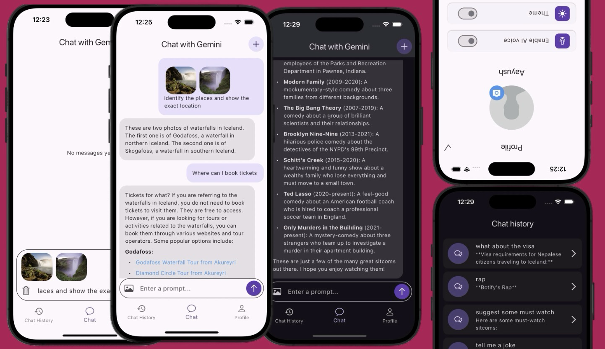

# **Ứng dụng AI Chatbot**
Đây là một ứng dụng Flutter cung cấp giao diện trò chuyện với một chatbot AI tên là Gemini. Người dùng có thể tương tác với Gemini trong thời gian thực, xem lại các tin nhắn trước đó và gửi tin nhắn mới.

# **Tính năng**
Giao diện trò chuyện: Tương tác hai chiều với chatbot AI.

Lịch sử trò chuyện: Truy cập và xem lại các cuộc trò chuyện trước đó với Gemini.

Cuộn liền mạch: Màn hình trò chuyện tự động cuộn xuống để hiển thị tin nhắn mới nhất, đảm bảo luồng trò chuyện mượt mà.

Lưu trữ dữ liệu cục bộ: Ứng dụng sử dụng Hive để lưu trữ tin nhắn trò chuyện hoặc dữ liệu ứng dụng khác trên thiết bị (tùy thuộc vào các phụ thuộc hive và hive_flutter).

# **Các thư viện sự dụng**
flutter: Khung công tác cốt lõi để xây dựng ứng dụng di động đa nền tảng.

cupertino_icons (tùy chọn): Cung cấp các biểu tượng Cupertino cho phong cách iOS trông tự nhiên hơn.

flutter_dotenv (tùy chọn): Cho phép tải các biến môi trường từ tệp .env.

flutter_markdown: Cho phép hiển thị nội dung markdown trong ứng dụng của bạn.

flutter_spinkit (tùy chọn): Cung cấp các hiệu ứng tải khác nhau để phản hồi trực quan.

google_generative_ai: Tích hợp với các dịch vụ AI tạo sinh của Google để cung cấp chức năng chatbot.

firebase: Cung cấp những dịch vụ như authenticaion và lưu trữ database.

firestore: Cung cấp dịch vụ lưu trữ database của firebase.

fireauthenticaion: Cung cấp dịch vụ đăng nhập đăng ký sẵn có

image_picker: Cho phép chọn ảnh từ thư viện hoặc máy ảnh của thiết bị.

path_provider: Giúp xác định các đường dẫn hệ thống tệp cụ thể cho nền tảng để lưu trữ dữ liệu.

provider: Giải pháp quản lý trạng thái để quản lý dữ liệu ứng dụng trên các widget.

uuid: Tạo các định danh duy nhất toàn cầu (UUID) cho các mục đích khác nhau.

# **Thiết lập phát triển**
Yêu cầu tiên quyết: Đảm bảo bạn đã cài đặt Flutter và Dart trên máy phát triển của mình. Bạn có thể làm theo hướng dẫn cài đặt chính thức tại Flutter Get Started.

Sao chép hoặc tải xuống dự án: Lấy mã dự án, bằng cách sao chép kho lưu trữ Git hoặc tải xuống các tệp nguồn.

Lấy API Gemini của bạn: Truy cập Google AI for Developers và lấy khóa API của bạn.

Chạy ứng dụng: Điều hướng đến thư mục dự án trong terminal của bạn và thực thi lệnh flutter run.

# **Cách sử dụng**
Màn hình chính là điểm điều hướng trung tâm cho ứng dụng chatbot AI này. Người dùng có thể:

Xem lịch sử trò chuyện của họ.

Tham gia trò chuyện thời gian thực với chatbot.

Truy cập thông tin hồ sơ và cài đặt của họ.
